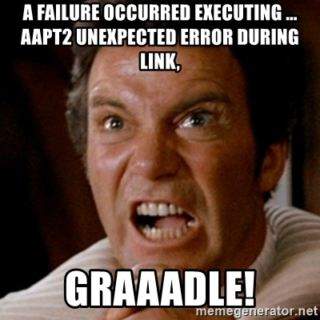
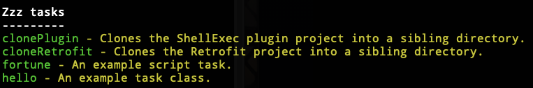

autoscale: true
build-lists: true
slidenumbers: false
theme: Fira, 2
list: alignment(left)
[.footer-style: alignment(right)]


---

## Gradle Isn't Just a
# Bad Word
# 🤬

^
https://360andev.com/session/gradle-isnt-just-a-bad-word/
Inspired by my Mobile DevOps experience supporting Android developers
building gradle plugins
including one that coordinated the Android Gradle Plugin

---



^
The way Android devs use the word "gradle" it sounds like profanity
only hear it when their build breaks.

---

# Goals 🎯

- reduce fear of Gradle
- help you understand Stack Overflow snippets
- new tools to help debug builds

---

# Agenda 🗓

- 🏛 Project Structure
- ⌨️ Invoking Gradle from the CLI
- ✅ Creating Tasks
- 🔌 Plugins
- 👩‍👩‍👧‍👦 Dependencies
- 🧱 Composite Projects

^
Composite projects are a neat trick for debugging and/or modifying a dependency
while testing it inside your app!

---

# Gradle Project Structure

- Wrapper
- File Layout
- Project Hierarchy

---

## Rapper?


^
no, not that kind of rapper

---

## Wrapper

```
└─── gradle
│   └── wrapper
│       └── gradle-wrapper.jar
│       └── gradle-wrapper.properties
├── gradlew
└── gradlew.bat
```

^
no need to install gradle
wrapper pins version of gradle
check these files into git

---

## Files

- build.gradle
- settings.gradle
- gradle.properties

---

## Android/Gradle Scripts

```
.
├── app
│   └── build.gradle
├── build.gradle
├── gradle.properties
├── local.properties
├── module
│   └── build.gradle
└── settings.gradle
```

---

## Project Hierarchy

```
Root project 'CompositeProject'
+--- Project ':app'
\--- Project ':module'
```

View using the "projects" task.


^
Each line lists a gradle project within a multi-project setup.
Every Android project is a multi-project where the root is just for configuration.
Gradle uses semicolon as Hierarchy notation
a single semicolon references the "root" project in a multi-project


---

# Invoking Gradle from the CLI

---

## Invoking the Wrapper

- `./gradlew taskName`
- `gradlew.bat taskName`
- `gw taskName`

^
Always run from root of the repo.
./ is needed on unix since the current dir is not on the PATH

---

# Wrapper Function (Bash & Z Shell)

```
function gw {
    if [ -e ./gradlew ]; then
        ./gradlew $argv
        return
    fi

    echo "There is no Gradle wrapper in the current dir."
    gradle $argv
}
```

[.footer: ~/.bashrc or ~/.zshrc]

^
Put this in your .bashrc or .zshrc

---

# Wrapper Function (Fish Shell)

```
function gw
    if test -e ./gradlew
        ./gradlew $argv
        return
    end

    echo "There is no Gradle wrapper in the current dir."
    gradle $argv
end
```

[.footer: ~/.config/fish/functions/[gw.fish](https://github.com/phatblat/dotfiles/blob/master/.config/fish/functions/gw.fish)]

---

## Input

- build.gradle
- gradle.properties
- ~/.gradle/gradle.properties
- -Pproperty=value

---

## Output

- console
- log levels
- stacktrace
- build scans

---

# Tasks

- `gw tasks`
- `gw tasks --all`



^
without --all only dasks which have a "group" are shown
the group name is "zzz"

---

## Creating Tasks

- doLast

## dependsOn
## Dry Run

--dry-run
-m

---

# Plugins
## Buildscript
## Plugins Block
## Maven Coordinates vs Plugin ID


---

## Buildscript Block

^
dependencies (plugins) always use "classpath"

---

## Plugins Block

^
Android Studio 4.2 uses plugins block in subprojects/modules

---

## Maven Coordinates vs Plugin ID

---

# Dependencies
## Implementation, Api and Compile

---

# Composite Projects

---

```
includeBuild(file("../ShellExec")) {
    dependencySubstitution {
        substitute module('at.phatbl:shellexec') with project(':')
    }
}
```

^
Tells gradle to substitute the dependency with the given project

---

↪ gw clonePlugin cloneRetrofit

> Task :clonePlugin
Cloning into '../ShellExec'...

> Task :cloneRetrofit
Cloning into '../retrofit'...


↪ gw projects
Including /Users/phatblat/dev/android/ShellExec project in composite build.
Including /Users/phatblat/dev/android/retrofit project in composite build.


---

https://github.com/phatblat/CompositeProject

---

# Problem

^
If I've been successful, then we have a problem.
You've just lost a bad word from your vocabulary.

---

# Profanity 🤬

- frak
- p'tak
- frell
- cruk
- shazbot
- kriff
- gorram

^
https://gizmodo.com/10-scifi-curse-words-for-all-occasions-1792827239

---

> kriffing nerf herder
